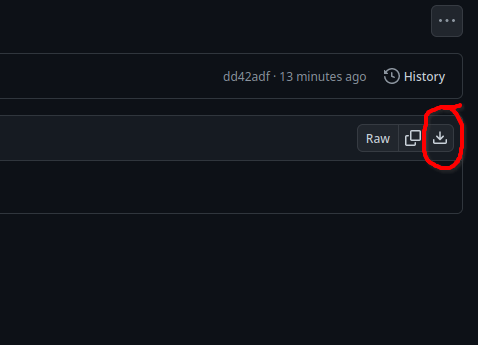

# Welcome To Global SSH! 🎉️

## Why Should I Use It?

SSH can be difficult to set up and maintain, requiring software installation and configuration on both local and remote systems, as well as firewall and access control configuration. Global SSH removes this complexity, making it accessible to non-technical users.

Moreover, Global SSH is more scalable than SSH, particularly in larger networks. With SSH, configuring and managing port forwarding settings becomes increasingly challenging as the network grows. Any changes or updates to port forwarding settings must be made on each device individually, which can be time-consuming and error-prone. In contrast, Global SSH requires only a Redis database to handle connections and can be easily scaled by creating new free accounts.

In summary, Global SSH offers an easier, more secure, and scalable alternative to SSH, with a simple setup process and minimal maintenance overhead.

## Features 🚀️

1. Easy setup: Global SSH can be set up in less than 5 minutes with a key file named redis_key.json placed in the home directory (~) of any Unix computer, making it easy to set up hosts or clients.
2. Low resource consumption: Global SSH is not resource-intensive and can even work in poor Wi-Fi conditions.
3. User-friendly: Global SSH is extremely easy to use, with a very low learning curve.
4. Easy switching between server and client: With Global SSH, you can easily switch between being a server or client by typing a simple command in the terminal. For server mode:`$ global_ssh server`, and for client mode:`$ global_ssh client`.
5. No port forwarding needed: Global SSH eliminates the need for port forwarding to connect hosts and clients across networks.
6. Platform agnostic: Global SSH client mode works on all platforms, including chips like 386 and ARM.
7. Unix compatible: Global SSH server mode works on all Unix-based systems, but not on Windows.

# Setup

## Step 1, Install

1. First go to the release directory or vist this link https://github.com/carghai/Global_SSH_V2/tree/main/releases 
2. Next find your OS and chip, for example if I'm an apple user with an M1 chip I will look for dawrin(apple) os and the arm64 version, It will look like global_ssh_darwin_arm64.tar.gz. If you are on x86 machine look for amd. If you try to run the binary and it doesn't work then you installed the wrong version.
3. Now click it then hit the download buttion in the corner

   
4. Next extract the tar file or zip, this can be done by a tool or by the command line
5. If your on windows, open power shell and do ``Start-Process -FilePath “<Path/global_ssh>” ``, if your having problems look [here](https://www.technewstoday.com/how-to-run-exe-in-powershell/)
6. If you are on unix based os, go to the terminal and go into the directory of the **unzip** tar file. Then do these commands to run it. 

   
